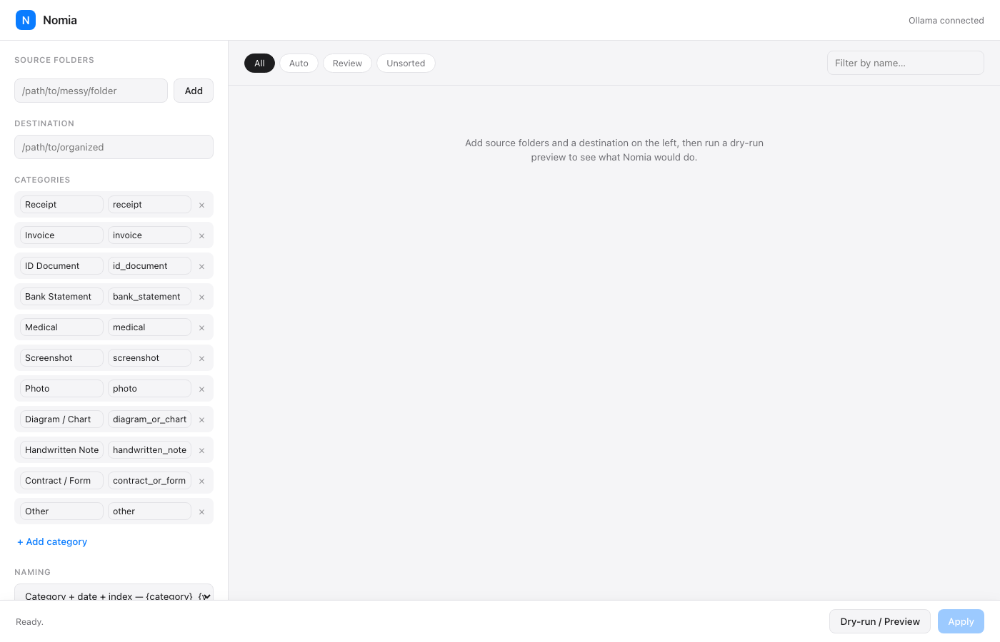
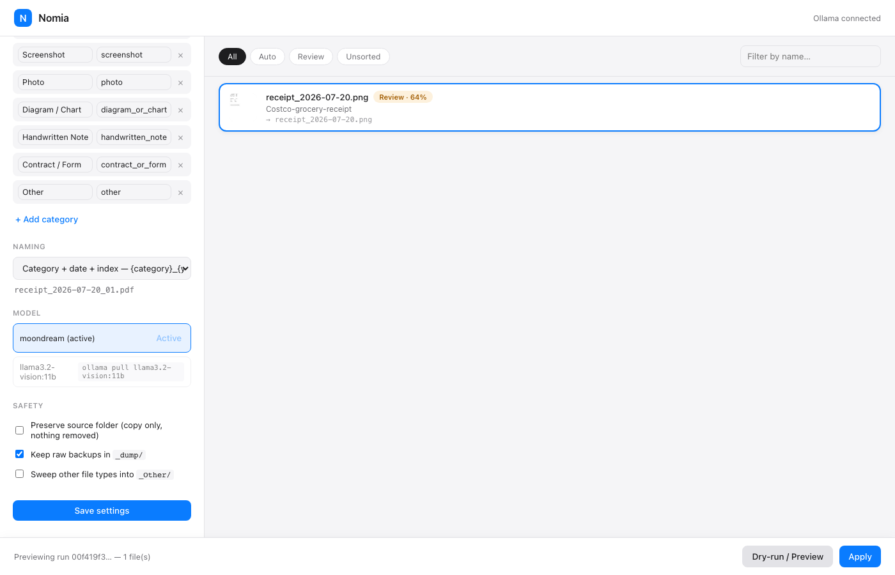
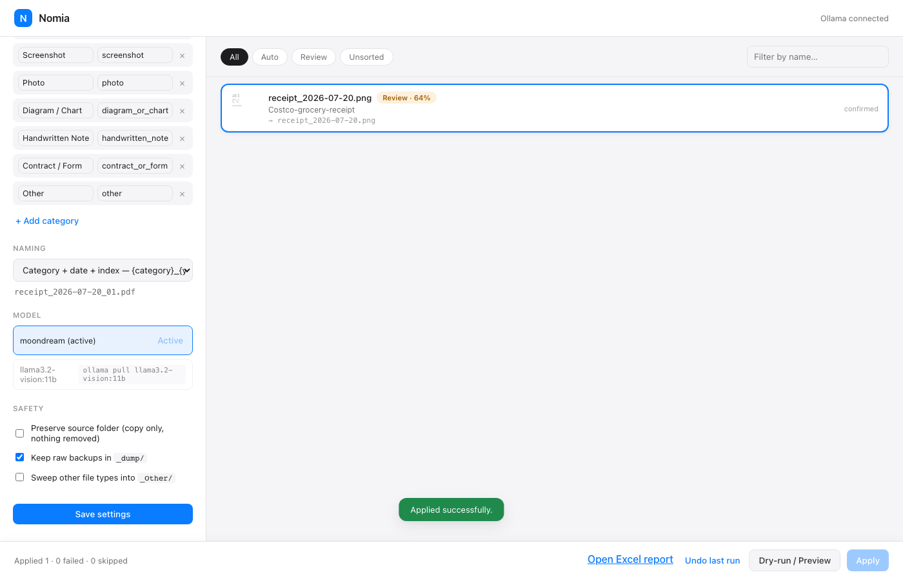

# Nomia

A local-first, AI-powered file organizer. Point it at messy source folders — a local vision
model classifies each image and PDF, moves files into an editable destination structure,
optionally renames them sensibly, and produces an Excel log explaining every decision.
Fully offline. No cloud calls, no API keys, no subscription.

*Nomia* — from the Greek suffix *-nomia* (as in taxonomy, econ**omy**, auton**omy**): order,
distribution, classification. The name was chosen for what the tool actually does: bringing
order to chaotic files.

## Why this exists

Most "AI file organizer" demos show the happy path: a clean folder of receipts, a model that's
always right, a satisfying before/after. Real folders aren't like that — duplicate scans,
corrupt files, password-protected PDFs, near-identical copies with slightly different names,
and a small local vision model that is sometimes just wrong.

The interesting engineering problem isn't "classify an image" — it's **what happens when the
model is uncertain, or wrong, or the file is unreadable, and the tool still has to behave
safely and explain itself.** That's what most of this codebase is actually about:

- **Confidence routing.** Every classification gets a confidence score. High-confidence results
  file automatically; mid-confidence results wait for a human to confirm; low-confidence and
  failed classifications go to a clearly-labeled `_Unsorted/` folder rather than guessing.
- **An explainable log, not just a diff.** Every file Nomia looks at — including duplicates,
  corrupt files, and things it left untouched — gets a row in the generated Excel report with
  the category, confidence, and the model's own one-line reason.
- **Non-destructive by construction.** Nomia never overwrites a file and never deletes a source
  file — only moves, and only after verifying the copy. Every applied run writes an undo journal,
  so the whole batch can be rolled back. See [CLAUDE.md](CLAUDE.md) for the full list of
  invariants this is built around.

## How it works

```
Source folders
   → scan (walk dirs, dedupe by content hash)
   → extract signals per file (EXIF, PDF page render, image decode, path context)
   → classify (single Ollama vision call → structured JSON)
   → confidence routing (auto / review / unsorted)
   → naming (template engine → collision + copy-ordering logic)
   → organize (dry-run preview → move/copy, with undo journal)
   → report (Excel log of every decision)
```

Each file is read once. Every extracted signal (EXIF date, GPS, path context, PDF page count)
is bundled with the rendered image into a single structured-JSON call to a local Ollama model —
no multi-pass reasoning, no chained prompts.

**Models:** `moondream` by default (small, fast, good enough for coarse categories);
`llama3.2-vision:11b` as an opt-in accuracy mode, selectable per run.

## Quickstart

Requires Python 3.11+, [uv](https://docs.astral.sh/uv/), and [Ollama](https://ollama.com/)
running locally.

```bash
git clone <this repo>
cd Nomia
uv sync
ollama pull moondream
# optional, for the accuracy-mode model:
ollama pull llama3.2-vision:11b

uv run nomia doctor        # confirms Ollama + the image/PDF libraries are ready
uv run nomia serve         # launches the local web UI at http://127.0.0.1:8000
```

Or drive it entirely from the CLI:

```bash
uv run nomia plan --source ~/Downloads --dest ~/Organized   # dry-run preview, prints a run ID
uv run nomia apply <run_id>                                   # applies it
uv run nomia verify <run_id>                                  # re-checks counts + hashes
uv run nomia undo <run_id>                                     # rolls the whole run back
```

No `uv`? `pip install -r requirements.txt` works too (see `requirements.txt`, kept in sync with
`pyproject.toml`).

## The UI

A single-page local web app: a left panel for source/destination folders, the editable category
tree, naming template (with a live example preview), model choice, and the safety toggles below;
a keyboard-driven review grid in the main panel (`↑`/`↓` to navigate, `Space`/`Enter` to confirm,
`E` to edit a proposed name, `S` to skip); and a two-step **Dry-run → Preview → Apply** flow with
a progress bar, a post-apply summary, a link to the generated Excel report, and an "Undo last run"
button.

<p>
  
  
  
</p>

## Safety toggles

Beyond the default move-with-undo-journal behavior:

- **Preserve source folder** — copy-only; the source folder is never modified at all.
- **Keep raw backups in `_dump/`** — every applied file also gets a verbatim, unrenamed copy at
  `{destination}/_dump/`, independent of the organized/renamed copy in its category folder.
- Every apply ends with an automatic **count and hash verification pass** — every scanned file
  accounted for by final status, and destination/dump bytes re-hashed against the source. Any
  mismatch is a visible, critical finding in both the API response and the Excel report's
  Verification sheet, never silently swallowed.

## Naming templates

A dropdown of presets, or a custom template using tokens `{category}` `{subcategory}`
`{description}` `{original}` `{index}` `{yyyy}` `{mm}` `{dd}` `{date}` `{confidence}` `{location}`.

| Preset | Template | Example output |
|---|---|---|
| Category + date + index | `{category}_{yyyy}-{mm}-{dd}_{index}` | `receipt_2026-07-20_01.pdf` |
| Date + description | `{yyyy}-{mm}-{dd}_{description}` | `2026-07-20_costco-receipt.pdf` |
| Description + date | `{description}_{yyyy}-{mm}-{dd}` | `costco-receipt_2026-07-20.pdf` |
| Foldered by category/year | `{category}/{yyyy}/{description}` | `receipt/2026/costco-receipt.pdf` |
| Keep original, tag category | `{original}__{category}` | `scan001__receipt.pdf` |

When several files would render to the same name (near-duplicate copies like `invoice.pdf`,
`invoice (1).pdf`, `invoice copy.pdf`), they're grouped and assigned a sequential `{index}`
sorted by creation date, oldest first — stable across re-runs. True byte-identical duplicates
are detected separately, by content hash, before classification ever runs.

## Accuracy — measured, not claimed

This README does not quote a made-up accuracy percentage. `tests/benchmark.py` runs the real
classification pipeline against a labeled set in `tests/sample_files/` (synthetic/mock documents
— no real personal data) and reports per-category precision/recall/F1, a confusion matrix, and,
more usefully, a **route-vs-correctness cross-tab**: does confidence routing actually catch the
model's mistakes, or do wrong predictions occasionally sneak through at "auto" confidence?

```bash
uv run python tests/generate_sample_files.py   # (re)generates the labeled fixture set
uv run python tests/benchmark.py --model default    # moondream
uv run python tests/benchmark.py --model accuracy   # llama3.2-vision:11b, if pulled
uv run python tests/benchmark.py --model both
```

Results are written to `tests/benchmark_results.json`. If you want a number, run it yourself —
these will drift run to run (the model isn't fully deterministic) and will look different on
your own files.

The most recent run against `moondream` on the 15-file labeled set here (2026-07-20):
**33.3% overall accuracy** — a small, fast model isn't very accurate on a deliberately
mixed/ambiguous synthetic test set, and this README says so plainly rather than picking a
flattering run. The part worth actually paying attention to is the route/correctness breakdown:

| Route | Correct | Incorrect | % correct |
|---|---|---|---|
| auto | 0 | 0 | — |
| review | 5 | 5 | 50% |
| unsorted / failed | 0 | 5 | 0% (by definition — no prediction was made) |

**Not one item was ever routed to `auto` in this run.** Every classification the model produced
— right or wrong — landed in `review` (waiting for a human to confirm) or was flagged as
unparseable and routed to `_Unsorted/`. That's the actual point of the confidence-routing design:
it isn't there to make the model look more accurate than it is, it's there so a mediocre-but-fast
local model never gets to silently auto-file a wrong guess. The benchmark also caught a real
failure mode worth documenting honestly: on harder/more ambiguous images, `moondream` sometimes
echoes the entire category list back as its answer instead of picking one (e.g.
`"receipt, invoice, id_document, bank_statement, ..."`) rather than a real key — `classify.py`
detects and rejects this (an implausibly long "category" value) rather than accepting it, routing
those files to `_Unsorted/` instead of risking a nonsense destination folder name. If accuracy
matters more than speed for your files, switch to the `llama3.2-vision:11b` accuracy mode and
run the benchmark again — the whole point of shipping this script is that you don't have to take
this README's word for it either way.

## Project layout

```
nomia/
├── config.py       # schema, defaults, atomic load/save
├── scanner.py      # walk, hash, hash-dedupe
├── extract.py      # EXIF, HEIC, PDF page render, error handling
├── classify.py     # the Ollama call, JSON validate/repair, confidence routing
├── naming.py       # template engine, slugify, copy-ordering, collision resolution
├── pipeline.py     # orchestrates scan → extract → classify → naming into a dry-run plan
├── organizer.py    # undo journal, apply/undo/verify/resume
├── report.py       # Excel log generation
├── server.py       # FastAPI wrapper (no business logic of its own)
└── cli.py          # command-line entry point
web/                # static HTML/CSS/JS UI, no build step
tests/              # unit tests, labeled sample_files/, benchmark.py
```

See [CLAUDE.md](CLAUDE.md) for the full design contract: the non-negotiable invariants, the
exact JSON schema, the copy-ordering rule, and coding conventions.

## Stack

Python 3.11+, managed with `uv` · `ollama` · `PyMuPDF` · `Pillow` + `pillow-heif` · `openpyxl` ·
`FastAPI` + `uvicorn` · `pydantic` · `platformdirs` · vanilla HTML/CSS/JS for the UI.

## License

MIT — see [LICENSE](LICENSE).
