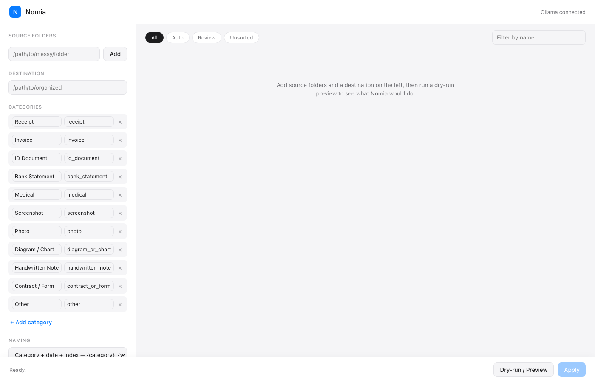
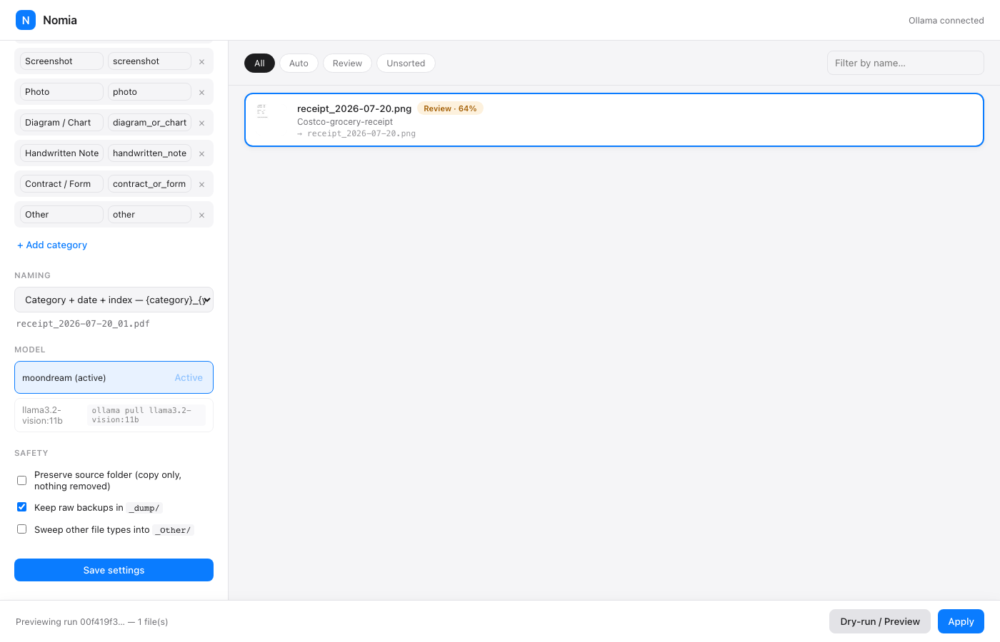
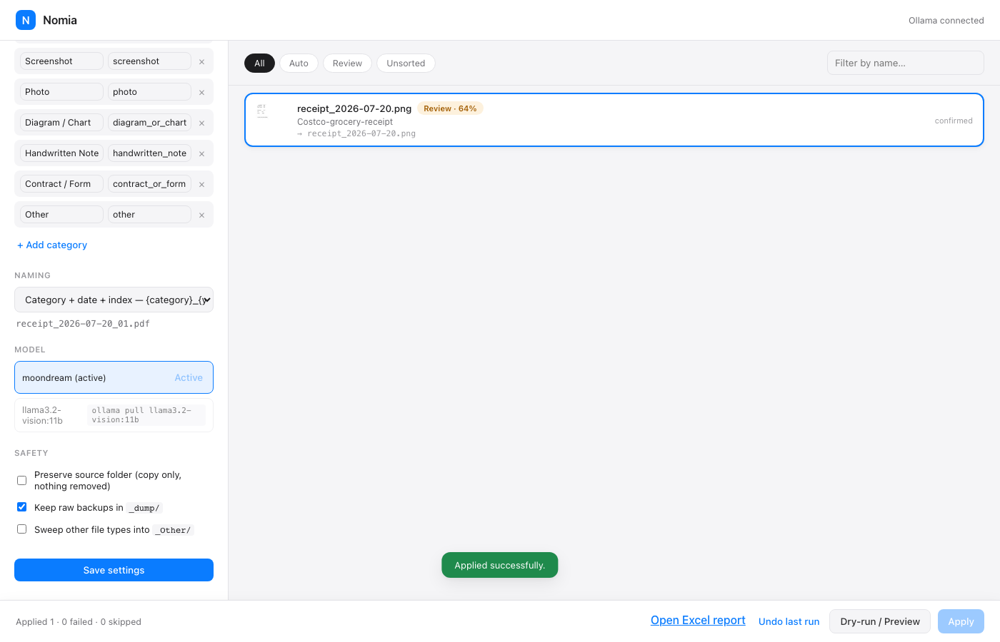

# Nomia

A local-first, AI-powered file organizer. Point it at messy source folders — a local vision
model classifies each image and PDF, moves files into an editable destination structure,
optionally renames them sensibly, and produces an Excel log explaining every decision.
Fully offline. No cloud calls, no API keys, no subscription.

*Nomia* — from the Greek suffix *-nomia* (as in taxonomy, econ**omy**, auton**omy**): order,
distribution, classification. The name was chosen for what the tool actually does: bringing
order to chaotic files.

## Why this exists

Most "AI file organizer" demos show the happy path: a clean folder of receipts, a model that's
always right, a satisfying before/after. Real folders aren't like that — duplicate scans,
corrupt files, password-protected PDFs, near-identical copies with slightly different names,
and a small local vision model that is sometimes just wrong.

The interesting engineering problem isn't "classify an image" — it's **what happens when the
model is uncertain, or wrong, or the file is unreadable, and the tool still has to behave
safely and explain itself.** That's what most of this codebase is actually about:

- **Confidence routing.** Every classification gets a confidence score. High-confidence results
  file automatically; mid-confidence results wait for a human to confirm; low-confidence and
  failed classifications go to a clearly-labeled `_Unsorted/` folder rather than guessing.
- **An explainable log, not just a diff.** Every file Nomia looks at — including duplicates,
  corrupt files, and things it left untouched — gets a row in the generated Excel report with
  the category, confidence, and the model's own one-line reason.
- **Non-destructive by construction.** Nomia never overwrites a file and never deletes a source
  file — only moves, and only after verifying the copy. Every applied run writes an undo journal,
  so the whole batch can be rolled back. See [CLAUDE.md](CLAUDE.md) for the full list of
  invariants this is built around.

## How it works

```
Source folders
   → scan (walk dirs, dedupe by content hash)
   → extract signals per file (EXIF, PDF page render / text layer / OCR, image decode, path context)
   → classify (fast path: SigLIP + keyword evidence → vision-model fallback for ambiguous files)
   → confidence routing (auto / review / unsorted)
   → naming (template engine → collision + copy-ordering logic)
   → organize (dry-run preview → move/copy, with undo journal)
   → report (Excel log of every decision)
```

Each file is read once. With the optional fast path installed, most files are classified in a
fraction of a second by a small discriminative model (SigLIP zero-shot over your editable
category list) fused with keyword evidence found in the document's own text (PDF text layer, or
Apple-Vision OCR on macOS). Only files the fast path isn't confident about go to the slower
Ollama vision model — as a single structured-JSON call bundling every extracted signal; no
multi-pass reasoning, no chained prompts. Three modes, selectable in config/UI: `router`
(default, fast path + VLM fallback), `fast_only` (never calls Ollama), `off` (VLM for every
file, the original behavior).

**Models:** `google/siglip-base-patch16-224` for the fast path (optional extra); `qwen3.5:4b` as
the default Ollama fallback (best VLM measured on the real benchmark set); `llama3.2-vision:11b`
as an opt-in accuracy mode, selectable per run.

## Quickstart

Requires Python 3.11+, [uv](https://docs.astral.sh/uv/), and [Ollama](https://ollama.com/)
running locally.

```bash
git clone <this repo>
cd Nomia
uv sync
ollama pull qwen3.5:4b
# optional, for the accuracy-mode model:
ollama pull llama3.2-vision:11b

# strongly recommended on macOS: on-device OCR + the SigLIP fast path
# (~2.5GB of ML deps; SigLIP weights download once on first use, then fully offline)
uv sync --extra macos --extra fastpath

uv run nomia doctor        # confirms Ollama + the image/PDF libraries are ready
uv run nomia serve         # launches the local web UI at http://127.0.0.1:8000
```

> Intel Macs: the project pins Python 3.12 (`.python-version`) because the last
> Intel-macOS PyTorch wheel (2.2.2, needed by the fast path) has no 3.13 build.

Or drive it entirely from the CLI:

```bash
uv run nomia plan --source ~/Downloads --dest ~/Organized   # dry-run preview, prints a run ID
uv run nomia apply <run_id>                                   # applies it
uv run nomia verify <run_id>                                  # re-checks counts + hashes
uv run nomia undo <run_id>                                     # rolls the whole run back
```

No `uv`? `pip install -r requirements.txt` works too (see `requirements.txt`, kept in sync with
`pyproject.toml`).

## The UI

A single-page local web app: a left panel for source/destination folders, the editable category
tree, naming template (with a live example preview), model choice, and the safety toggles below;
a keyboard-driven review grid in the main panel (`↑`/`↓` to navigate, `Space`/`Enter` to confirm,
`E` to edit a proposed name, `S` to skip); and a two-step **Dry-run → Preview → Apply** flow with
a progress bar, a post-apply summary, a link to the generated Excel report, and an "Undo last run"
button.

<p>
  
  
  
</p>

## Safety toggles

Beyond the default move-with-undo-journal behavior:

- **Preserve source folder** — copy-only; the source folder is never modified at all.
- **Keep raw backups in `_dump/`** — every applied file also gets a verbatim, unrenamed copy at
  `{destination}/_dump/`, independent of the organized/renamed copy in its category folder.
- Every apply ends with an automatic **count and hash verification pass** — every scanned file
  accounted for by final status, and destination/dump bytes re-hashed against the source. Any
  mismatch is a visible, critical finding in both the API response and the Excel report's
  Verification sheet, never silently swallowed.

## Naming templates

A dropdown of presets, or a custom template using tokens `{category}` `{subcategory}`
`{description}` `{original}` `{index}` `{yyyy}` `{mm}` `{dd}` `{date}` `{confidence}` `{location}`.

| Preset | Template | Example output |
|---|---|---|
| Category + date + index | `{category}_{yyyy}-{mm}-{dd}_{index}` | `receipt_2026-07-20_01.pdf` |
| Date + description | `{yyyy}-{mm}-{dd}_{description}` | `2026-07-20_costco-receipt.pdf` |
| Description + date | `{description}_{yyyy}-{mm}-{dd}` | `costco-receipt_2026-07-20.pdf` |
| Foldered by category/year | `{category}/{yyyy}/{description}` | `receipt/2026/costco-receipt.pdf` |
| Keep original, tag category | `{original}__{category}` | `scan001__receipt.pdf` |

When several files would render to the same name (near-duplicate copies like `invoice.pdf`,
`invoice (1).pdf`, `invoice copy.pdf`), they're grouped and assigned a sequential `{index}`
sorted by creation date, oldest first — stable across re-runs. True byte-identical duplicates
are detected separately, by content hash, before classification ever runs.

## Accuracy — measured, not claimed

This README does not quote a made-up accuracy percentage. `tests/benchmark.py` runs the real
classification pipeline against a labeled set in `tests/sample_files/` (synthetic/mock documents
— no real personal data) and reports per-category precision/recall/F1, a confusion matrix, and,
more usefully, a **route-vs-correctness cross-tab**: does confidence routing actually catch the
model's mistakes, or do wrong predictions occasionally sneak through at "auto" confidence?

```bash
uv run python tests/generate_sample_files.py   # (re)generates the synthetic fixture set
uv run python tests/benchmark.py --model default    # config default model, VLM-only
uv run python tests/benchmark.py --mode fast   --sample-dir tests/real_sample_files
uv run python tests/benchmark.py --mode tiered --sample-dir tests/real_sample_files
```

Results are written to `tests/benchmark_results.json`. If you want a number, run it yourself —
these will drift run to run and will look different on your own files.

**Test on your own real files** (the most honest benchmark there is — nothing ever leaves
your machine): make a folder with one subfolder per category key, drop in your own modern
receipts, bills, screenshots, and photos, then:

```bash
uv run python tests/make_labels.py ~/my_real_docs        # builds labels.json from folder names
uv run python tests/benchmark.py --mode tiered --sample-dir ~/my_real_docs
```

And for a zero-risk trial on a real messy folder (e.g. `~/Downloads`): the app's default
flow is already a dry run — `uv run nomia plan --source ~/Downloads --dest ~/Organized`
touches nothing on disk until you explicitly apply, and the `preserve_source` toggle keeps
the source byte-for-byte untouched even then.

Most recent runs on the 207-file real-world labeled set in `tests/real_sample_files/`
(2026-07-25, 2019 Intel MacBook Pro, CPU only):

| Pipeline | Accuracy | Mean latency | Auto-filed bucket |
|---|---|---|---|
| `moondream` VLM only | 27.1% | 29.6s/file | never reached auto confidence |
| Fast path only (SigLIP + keywords) | 81.2% | **0.21s/file** | 122 files auto, 95% of them correct |
| Tiered (fast path + `qwen3.5:4b` fallback) | 79.2% | 11.2s/file | fast tier auto-files 59% of files at 95% correct; every VLM-fallback answer routes to review |

The route/correctness cross-tab is the number that actually matters: a wrong guess that lands
in `review` costs a human three seconds; a wrong guess that auto-files is a real mistake. The
fast path's auto bucket was 95% correct in this run, and everything it wasn't sure about
(invoices vs. receipts, ambiguous medical forms) landed in `review`/`_Unsorted` — or, in the
default `router` mode, goes to the Ollama vision model for a second opinion instead.

The tiered run also exposed why `review_vlm_fallback` (default on) exists: the VLM reported
auto-level confidence on essentially every file the fast path had flagged as hard, while being
right on only ~57% of them. Small local VLMs are least calibrated exactly where they're needed
most — so a fallback answer is treated as a *suggestion for review*, never an auto-file. On the
fixture set the VLM's second opinion helps invoices and medical documents and hurts the (oddly
vintage) contract/form fixtures; on modern personal files the router default is expected to be
the right trade, and `fastpath.mode = "fast_only"` is one config switch away if you'd rather
never wait on the VLM at all.

Two honestly-documented failure modes from earlier VLM-only benchmarking still shape the design:
small vision models sometimes echo the whole category list back as their answer (rejected by
`classify.py` as an implausibly long category, routed to `_Unsorted/`), and they essentially
never produce well-calibrated high confidence on hard scans — which is why the discriminative
fast path, whose confidence is a real probability distribution over your categories, now fronts
the pipeline.

## Project layout

```
nomia/
├── config.py       # schema, defaults, atomic load/save
├── scanner.py      # walk, hash, hash-dedupe
├── extract.py      # EXIF, HEIC, PDF page render, error handling
├── classify.py     # the Ollama call, JSON validate/repair, confidence routing
├── naming.py       # template engine, slugify, copy-ordering, collision resolution
├── pipeline.py     # orchestrates scan → extract → classify → naming into a dry-run plan
├── organizer.py    # undo journal, apply/undo/verify/resume
├── report.py       # Excel log generation
├── server.py       # FastAPI wrapper (no business logic of its own)
└── cli.py          # command-line entry point
web/                # static HTML/CSS/JS UI, no build step
tests/              # unit tests, labeled sample_files/, benchmark.py
```

See [CLAUDE.md](CLAUDE.md) for the full design contract: the non-negotiable invariants, the
exact JSON schema, the copy-ordering rule, and coding conventions.

## Stack

Python 3.11+, managed with `uv` · `ollama` · `PyMuPDF` · `Pillow` + `pillow-heif` · `openpyxl` ·
`FastAPI` + `uvicorn` · `pydantic` · `platformdirs` · vanilla HTML/CSS/JS for the UI.

## License

MIT — see [LICENSE](LICENSE).
